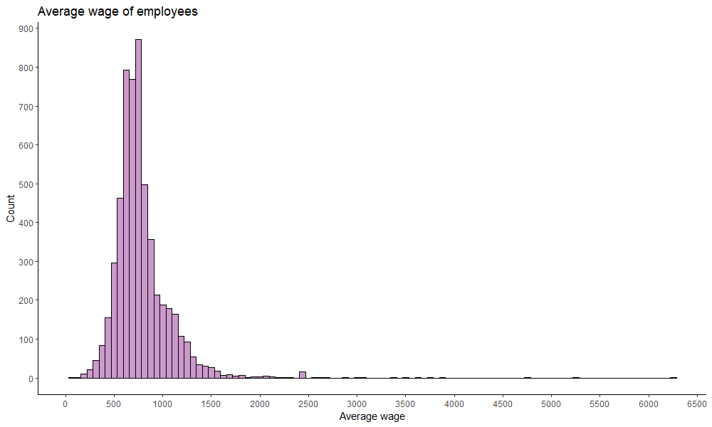
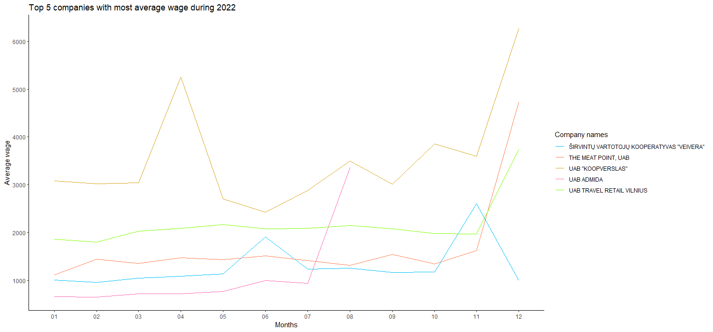
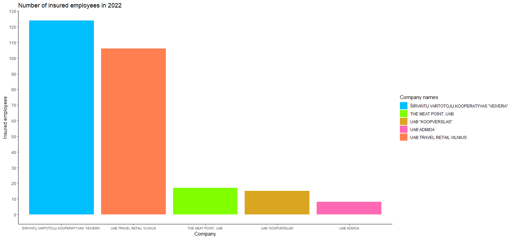
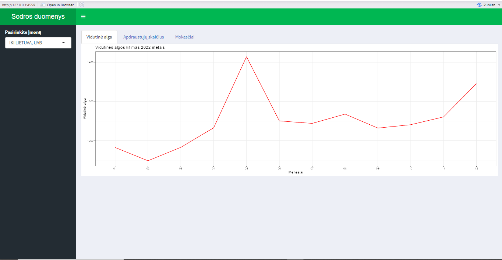

# R Laboratorinis darbas: duomenų vizualizacija

| Variantas | ecoActCode |
|------------- | ------------- |
| 9             |     471100 |

### 1. Užduotis

Atsakymas:

Išvados: Įmonėse, kurios užsiima mažmenine prekyba nespecializuotose parduotuvėse, kuriose vyrauja maistas, gėrimai ir tabakas, vidutinis darbo užmokestis yra apie 781 eurus, o didžiausias darbo užmokestis siekia 6269 eurus.

### 2. Užduotis

Atsakymas:

Išvados: 5 įmonės, kurių vidutinis darbo užmokestis 2022 metais buvo didžiausias yra: ŠIRVINTŲ VARTOTOJŲ KOOPERATYVAS "VEIVERA", UAB "THE MEAT POINT", UAB "KOOPVERSLAS", UAB "ADMIDA" ir UAB "TRAVEL RETAIL VILNIUS". Remiantis grafiku galima teigti, jog įmonėse UAB "TRAVEL RETAIL VILNIUS" ir UAB "THE MEAT POINT", vidutinis darbo užmokestis buvo pastovus, tačiau įsibėgėjus lapkričio mėnesiui ėmė sparčiai didėti. Įmonės UAB "ADMIDA" vidutinis darbo užmokestis taip pat buvo tolygus, tačiau antroje metų pusėje ėmė sparčiai didėti. Pilnai metų analizei trūko duomenų. UAB "KOOPVERSLAS" vidutinis atlyginimas yra pats aukčiausias, tačiau visus metus gan drastiškai kito. Įmonės ŠIRVINTŲ VARTOTOJŲ KOOPERATYVAS "VEIVERA" darbo užmokestis buvo ganėtinai tolygus, kas keletą mėnesių įvykdavo atlyginimo šuolis, tačiau tokia pačia sparta grįždavo į įprastą.

### 3. Užduotis

Atsakymas:

Išvados: Lygindami minėtųjų 5 įmonių apdraustų darbuotojų skaičių matome, kad daugiausia jų įmonėje ŠIRVINTŲ VARTOTOJŲ KOOPERATYVAS "VEIVERA" - 124, o UAB "TRAVEL RETAIL VILNIUS" jų 18 mažiau. Mažiausiai apdraustų darbuotojų yra įmonėje UAB "ADMIDA". Likusių įmonių apdraustų darbuotojų skaičius yra panašus.

### 4. Užduotis

Shiny R aplikacijos nuotrauka:

